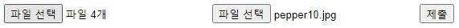
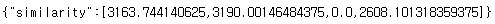

# AI 이미지 유사도 분석
> 유클리드 거리를 계산하여 유사도를 분석

<br/>
## 설치 및 실행 방법

```sh
pip install -r requirements.txt
python .\main.py
```


## 사용 예제




<br/>

>Thanks to https://github.com/luchonaveiro/image-search-engine !!